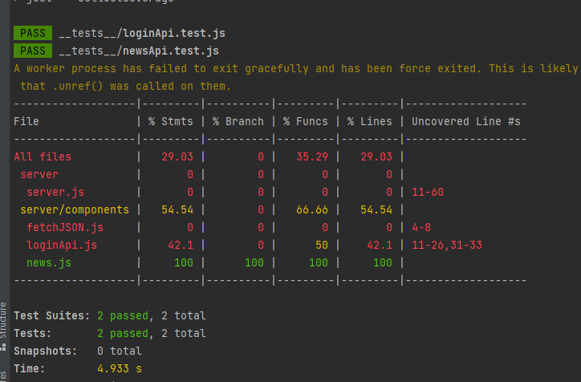
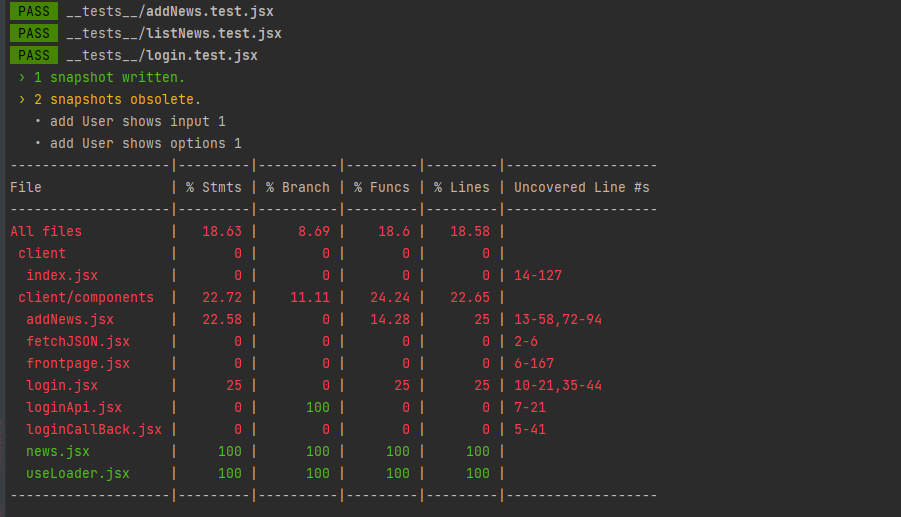

# PG6301 eksamen 

Karakter: B

Use this link to se what the code dose: [Heroku](https://cooljean95-exam.herokuapp.com/)







## Tips

* Bruk versjoner av alle dependencies som vi brukte på forelesningene. Det skjer hele tiden endringer i JavaScript-land og noen ganger vil siste versjon oppføre seg forskjellig - ikke kast bort verdifull eksamenstid. Du kan kopiere package.json fra innlevering eller en øving
* Spesielt: React 18 kom i løpet av semesteret. Alt vi har vist er på React 17. Kjør på React 17 nå med mindre du har brukt en del tid på versjon 18 den siste måneden. Det er vesentlige problemer!
* Start med å løse det kritiske: Deployment til Heroku
* Ikke bli sittende med ting du ikke får til mens det er enklere ting du kunne ha gjort. Spesielt tester har overraskende mye vrient med seg. Legg det til siden og løs andre ting om du har problemer
* Les de funksjonelle kravene grundig og test at løsningen din oppfyller dem
* Les læringsmålene beskrevet i eksamensteksten grundig og sjekk at løsningen din demonstrere at du behersker disse

Dette er versjonene vi brukte under forelesningene om som er validert som ok:

```
"jest": "^27.5.1",
"react": "^17.0.2",
"react-dom": "^17.0.2",
"react-router-dom": "^6.2.2"
```


## Egenutfylling av tekniske krav

* [x ] Lage en app med parcel, express, concurrently, prettier, Jest
* [ x] Sette opp en fungerende React app med React Router, håndtering av loading state og feilhåndtering
* [ x] Sette opp en fungerende Express app inkludert Routes i egen fil
* [ x] Kommunikasjon mellom klient og server med GET og POST inkludert feilhåndtering
* [x ] Deployment til Heroku
* [ /] Lagring, henting og endring av data i Mongodb
* [/ ] Login med OpenID Connect (både Google og Active Directory)
* [x ] Web Sockets
* [ ] Test coverage på 50-70% eller bedre dokumentert med Github Actions

 Jeg mangler å ha fått satt opp innloging til microsoft. Brukte mye tid på å få det til, men jeg klarte å bare få til enten google eller microsoft.
  Desverre ikke begge to samtidig. Så jeg har fjærnet alt av koden for microsoft for å rydde i prosjektet. Men det ligger i commit logen.
  Mangler å kunne oppdataere eldre data i databasen. 
  Web socket fungerer men ikke på en veldig pra måte. klarte ikke å lege event.data i en setState. setState ble bare undefinde selv om
  event.data hadde kommet fram til frontpage siden. 
  
Tester gikk heller ikke så bra desverre. jeg har en dell tester kommentert ut fordi de feiler. og jeg ikke helt klarer å finne årsaken. 
feilende tester ligger i loginApi.test/server, addNews.test/client, login.test/client

## Egenutfylling av tekniske krav
## Egenutfylling av funksjonelle krav

* [X ] Anonyme brukere skal se nyhetsaker når de kommer til nettsiden. Legg inn noen nyhetssaker for å demonstrere
* [X ] Når en ny sak publiseres, skal alle brukerne få se den nye saken umiddelbart. Bruk websockets for å sende oppdateringer
* [X ] Brukere kan logge seg inn. Det anbefales at du implementerer at brukerne logger seg inn med Google, men andre mekanismer er også akseptabelt
* [ X] En bruker som er logget inn kan se på sin profilside (userinfo fra Google)
* [x ]  Brukere skal forbli logget inn når de refresher websiden
* [ / ] En bruker som er logget inn kan klikke på en nyhetssak for å se detaljene om nyhetssaken. Detaljene skal inkludere en nyhetskategori, overskrift, tekst og navn på den som publiserte den
* [ ] "Redaksjonelle brukere" kan logge seg inn med Active Directory. Det må fungere å logge seg inn med en Active Directory på skolens AD ( domain_hint=egms.no )
* [ x] Redaksjonelle brukere kan publisere nye nyhetsartikler
* [ x]  Nyhetsartikkel skal inneholde en kategori valgt fra en nedtrekksliste ( <select> ), tittel ( <input> ) og tekst ( <textarea> )
* [ x] Dersom noen allerede har publisert en nyhetsartikkel med samme tittel skal serveren sende HTTP status kode 400 og en feilmelding
* [ x] Brukeren skal forhindres fra å sende inn en nyhetsartikkel som mangler kategori, tittel eller tekst
* [] En redaksjonell bruker skal kunne redigere en artikkel de selv har publisert
* [/] Alle feil fra serves skal presenteres til bruker på en pen måte, med mulighet for brukeren til å prøve igjen

